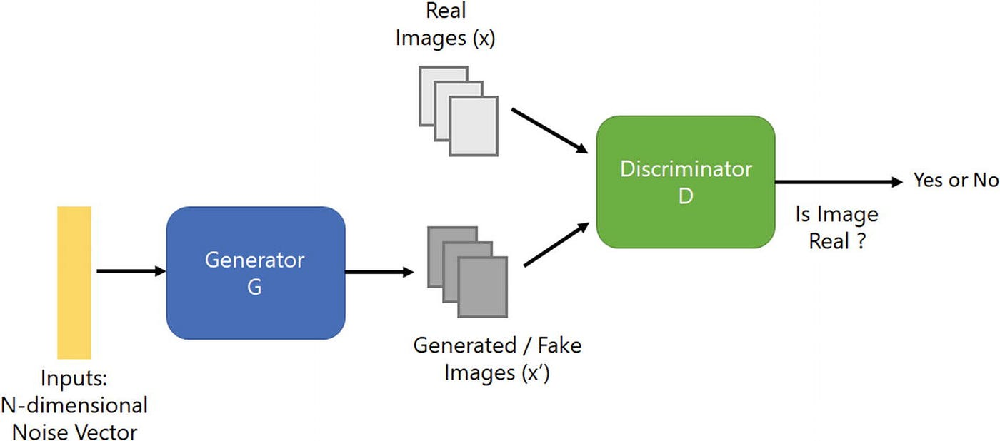
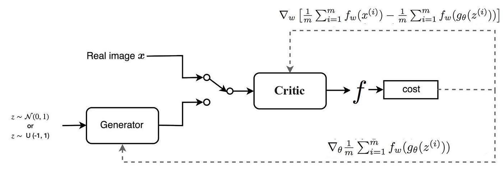
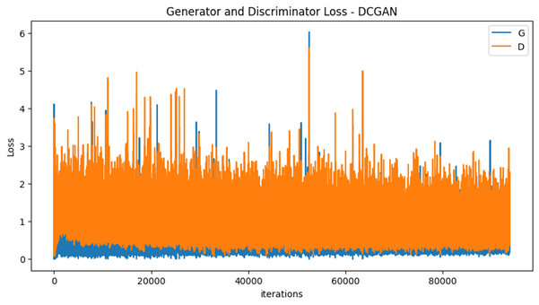
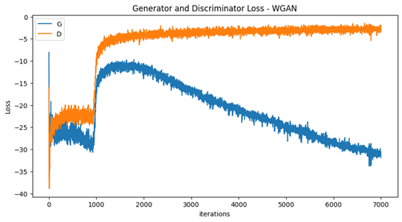
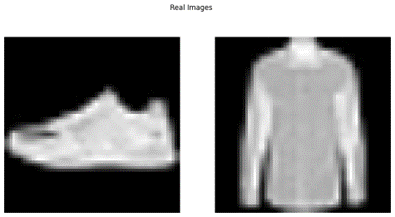
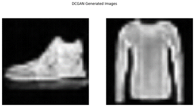
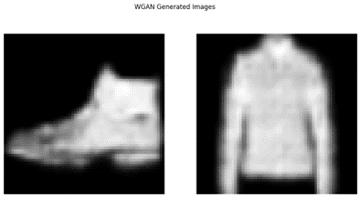

  <h1 align="center">DCGAN VS WGAN</h1>

## Introduction

In this section I implemented 2 GAN models. GAN stands for Generative Adversarial Network and its purpose to create realistic data by training a generator and discriminator simultaneously in a competitive manner. 
The first model is the classic DCGAN - Deep Convolutional GAN, and the second is the WGAN - Wasserstein GAN.
I implemented the model suggested in the paper "Improved Training of Wasserstein GANs", by Gulrajani et al. I made a few modifications to apply it on the Fashion MNIST dataset.
For the WGAN, I implemented it using the “Gradient Penalty” method.

<a href="https://arxiv.org/abs/1704.00028/"><strong>Paper Link</strong></a>

## Dataset

Fashion-MNIST is a dataset of Zalando's article images—consisting of a training set of 60,000 examples and a test set of 10,000 examples. Each example is a 28x28 grayscale image, associated with a label from 10 classes.

## Model

### DCGAN

  

### WGAN

  

## Hyperparameters

I chose the hyperparameters closet as I can to the suggested parameters in the paper:

### DCGAN
| Hyperparameter (DCGAN) | Value  |
|------------------------|--------|
| batch_size             | 64     |
| z_latent_vector_size   | 100    |
| n_channels             | 1      |
| num_epochs             | 100    |
| learning_rate          | 0.0002 |
| beta1                  | 0.5    |
| beta2                  | 0.999  |

### WGAN
| Hyperparameter (WGAN) | Value  |
|-----------------------|--------|
| batch_size            | 64     |
| z_latent_vector_size  | 100    |
| n_channels            | 1      |
| generator_iters       | 7000   |
| critic_iters          | 5      |
| learning_rate         | 0.0001 |
| beta1                 | 0.5    |
| beta2                 | 0.999  |

## Training Plots

### DCGAN

  

* Training Time: the training process of DCGAN takes longer compared to training other neural networks like DNNs. The adversarial nature of the training process demands more computational resources and iterations to achieve convergence. It took 15.5 hours on CPU.
Calculation of the number of iterations:
Iterations=Num of Epochs*Num of batches=
=Num of Epoch*(Num of Images / Batch Size)=
=100*(60000/64)=97,750 

* Convergence: It is hard to see the convergence of the plots because the high variance of the plots. In general, it can be seen that the two graphs fade and converge on average.

### WGAN

  

* Training Time: The training time of the WGAN + GP model was much longer compared to the training of the DCGAN model. It took more then 24 hours to train it on CPU.
Calculation of the number of iterations (for every 1 generator iteration, there are 5 discriminator iterations):
Iterations=Num of Generator Iterations=7,000

* Convergence: The WGAN loss plot looks completely different than the plot before. It less “noisy” and have a weird shape, not like usual loss functions that we are used to.
Up to 1000 iterations the plot has minor fluctuations, and the model seems to enter a local minimum. When it reached 1000 iterations the plot jumps significantly and it looks like it's going to get better, and after about 1500 iterations the loss of the discriminator stabilizes, and the loss of the generator slowly fades. As already know the training process is unstable and difficult to converge.

## Results

In the Results I will show real images from the dataset, the generated images by DCGAN and WGAN:

  

  

  

* As can see the DCGAN can generate high quality images. The colors and textures look very realistic. Although the shape of the shirt looks distorted compared to a real shirt.
* In contrast to the DCGAN model, the WGAN model didn’t generate high quality images, although it took twice as long to train it. Can see that half of the shoes is faded and the shirt looks pixelated.

## Conclusions

* Building these models was much more complex and took much more time. This was due to the complexity of the models and their complicated training methods compared to simple deep networks.
* When I wrote the code, I used a lot of examples of similar models, but it still took a lot of time to make the necessary changes.
* After the code did manage to compile, the models still failed to give images but only noise. At first, I tried to understand where I went wrong, and I saw that the training function was incorrect. After fixing this the models did manage to give us results, but they were very bad and did not look like clothes. So, I added a lot more iterations. I increased from 5 to 100 for the DCGAN and from 100 to 7000 for the WGAN.
* It is difficult for us to provide a number of failed convergence attempts, because it was many dozens.
* The training times were longer than usual. The DCGAN training took us about 15 hours and the WGAN training took over 24 hours. I decided to train the models on our personal computer, because Google Colab is limited in usage time, which made the training even longer without a GPU.
* If I would train the WGAN more iterations, I would probably get the same quality results as the DCGAN model, as shown in the paper.
